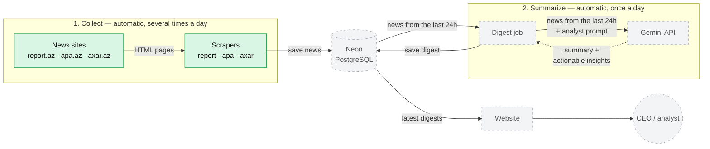

# az-news-assistant

Daily AI news digests for busy executives. Scrapers collect fresh articles from Azerbaijani news sites, store them in a database, and once a day Gemini reads all news from the last 24 hours and writes an industry digest (for example, for investment or banking) in the role of a senior analyst — with a high-level summary and actionable insights. The digest is shown on a website.

**Why:** CEOs and analysts don't have time to follow news sites, but they need to know what happened in their industry.

## Status

| Part | Status |
|---|---|
| Scrapers for report.az, apa.az, axar.az | ✅ done |
| Neon (PostgreSQL) database | ⏳ next |
| Digest job (Gemini API) | ⏳ planned |
| Website | ⏳ planned |
| GitHub Actions (automatic runs) | ⏳ planned |

## Architecture



Green — done, gray — planned.

## News sources

| Site | News in 24h | How pages are loaded | Where the date comes from |
|---|---|---|---|
| report.az | ~135–245 | infinite scroll, cursor (`/infinity/index?date=...`) | `data-timestamp` on the news card |
| apa.az | ~70 | page number (`/all-news?page=N`) | date and time on the news card |
| axar.az | ~115 | page in the URL (`/latest/pageN/`) | JSON-LD `datePublished` on the article page |

Each scraper:
1. goes through the news list page by page until it reaches news older than 24 hours
2. skips duplicates
3. opens every article and extracts its full text
4. saves the result to `data/<site>.csv`

## Project structure

```
az-news-assistant/
├── scraper_job/
│   ├── config.py              # shared settings: headers, timezone, hours back, max pages
│   ├── utils/
│   │   └── helpers.py         # shared functions: fetch_html, save_csv
│   └── scrapers/
│       ├── report_scraper.py  # report.az
│       ├── apa_scraper.py     # apa.az
│       └── axar_scraper.py    # axar.az
├── requirements.txt
└── README.md
```

## Run locally

```bash
python -m venv .venv
.venv\Scripts\activate          # Windows
pip install -r requirements.txt

python -m scraper_job.scrapers.report_scraper
python -m scraper_job.scrapers.apa_scraper
python -m scraper_job.scrapers.axar_scraper
```

Results are saved to the `data/` folder (not tracked by git).